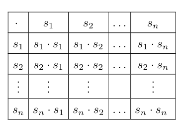

# SemigroupVerifier
Verifica si una operación lógica cumple los requisitos para ser un semigrupo.

Este código utiliza una cuadro de doble entrada para verificar operaciones lógicas diferentes de la suma y la multiplicación.
De tal manera que, se puedan comprobar la ley de composición interna y la asociatividad, necesarias para tener un semigrupo.

Programé este código hace 2 años aproximadamente (2023) durante una clase de la universidad, por lo que está algo desactualizado, sin embargo, consideré que era
buena idea subirlo en caso de que alguien necesite ayuda con alguna idea parecida.

Tecnologías utilizadas:
C++

------------------------------------------------------
# SemigroupVerifier
Verifies if a logic operator fulfills the requirements to be a semigroup.

This code uses a double input table to verify logic operators different from addition and multiplication.
In such a way that, you can test if the internal composition law and associative property are accomplished, in order to consider
this operator as a semigroup.

I coded this 2 years ago approximately (2023) during a college class, so it's a bit outdated, nonetheless, I considered it was a good idea to upload it
in case anyone needs help with a similar idea.

IMPORTANT NOTE: The code and Console UI are written in spanish, so have that in mind.

Technologies used:
C++
